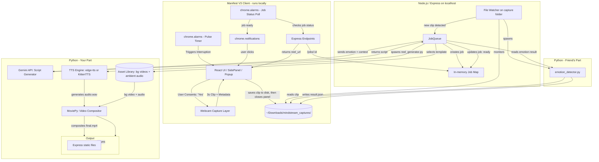

# MINDSTREAM — PROJECT OVERVIEW

_Local-first college project. This document is the single source of truth for any AI agent (or contributor) working in this repo — read this before touching code._

## 1. What This Is

MindStream is a browser extension that periodically checks in on a distracted/fatigued user, captures a brief webcam snapshot with explicit consent, infers their emotional state, and generates a short personalized 9:16 "focus reset" video reel using an LLM-written script + TTS + pre-built visual/audio templates. The reel is generated **asynchronously in the background** — the user is never made to sit and wait for it.

## 2. Core Problem Statement

Stress and loss of focus drive desktop users into unproductive doomscrolling loops, but current wellness tools rely on rigid restrictions or generic advice, failing to deliver the context-aware interventions needed to break these distraction cycles.

## 3. Project Scope: Local-First, College Project

This is **not** a hosted/cloud product. Everything runs on the developer's/user's own machine:

- The backend is a **local Node/Express server** (`localhost:<port>`), started manually (`node server.js` or similar) before the extension is used.
- The extension is **loaded unpacked** in the browser (Chrome, Manifest V3) pointed at that local server.
- No cloud queue, no hosted database, no multi-user concerns. Assume a single active user/session at a time — an in-process async queue (or even just an `async` function with a simple in-memory job map) is sufficient. Don't add infra (Redis, hosted job queues, etc.) that a college project doesn't need.
- External network calls are limited to the Gemini API (for script generation) — everything else (webcam, inference, rendering, storage) is local.
- The extension's `manifest.json` needs `host_permissions` covering the local server origin (e.g. `http://localhost:*/*`) since MV3 extensions must declare origins they fetch from.

## 4. The Interactive Check-In Flow

This is a sequence of distinct UI states, not one continuous screen — worth keeping the state machine explicit since several agents/contributors will be touching different parts of it.

1. **The Pulse Trigger:** After the user has been active in the browser for a threshold amount of time (tracked via `chrome.alarms`), the extension surfaces an **OS-level notification** (`chrome.notifications`) asking _"Want a quick snap check-in?"_ — not an in-panel prompt, since the side panel likely isn't open at this point.
2. **Consent & Skeleton State:** If the user clicks/accepts, the side panel opens and immediately shows a **skeleton loader** while the browser's native camera-permission dialog is pending. (That permission prompt is controlled by the browser, not the extension — the skeleton just covers the wait until the user responds to it.)
3. **The 3-Second Snap:** Once permission is granted, the panel shows a **live capture indicator** (the outgoing clip/preview) for ~3 seconds while `getUserMedia` records.
4. **Contextual Enrichment:** Alongside the clip, the extension packages local telemetry — active tab domain/category, time of day, session duration, idle time.
5. **Hand-off & Close:** The panel POSTs the payload, then shows an **in-panel countdown modal** — _"Your reel will be generated soon... 3, 2, 1"_ — then closes the side panel via `chrome.sidePanel.close({ tabId })` (Chrome 141+; see §8 for the version caveat and fallback).
6. **Background Processing:** The local server resolves the emotion, generates the script via Gemini, and composites the reel from a pre-built template (see §7). The user keeps working in the meantime.
7. **Mid-Process Errors:** If anything fails (no face detected, Gemini error, render failure), the extension surfaces an **OS-level notification** describing the issue, rather than leaving a stuck or broken panel.
8. **Ready Notification:** On success, another OS-level notification: _"Your snap is ready — wanna have a look?"_ Clicking it opens the side panel and plays the reel.

**Why this matters:** the intervention only works if it doesn't itself become a distraction. Nobody should be staring at a spinner — that's the opposite of the point.

### 4a. Pulse Timer State — Preventing Stacked/Duplicate Check-Ins

The Pulse Trigger (step 1) can't just be a dumb repeating alarm — without state, it will happily fire a _second_ check-in while the first reel is still rendering, or generate a brand-new reel because the user never clicked the "ready" notification for the last one. Since the backend only has one job slot at a time (§3), the extension has to guarantee only one check-in cycle is ever "active" (in flight or awaiting viewing) at once.

Track one small piece of state in `chrome.storage.local`, e.g.:

```json
{
  "cycle_status": "idle", // "idle" | "pending" | "ready" | "viewed" | "failed"
  "cycle_started_at": "2026-07-10T14:32:00Z"
}
```

On every `pulseTimer` tick, before doing anything else, check `cycle_status`:

- **`"pending"`** → a check-in is already being processed. Skip — don't show the "want a check-in?" prompt again. Just let the alarm re-fire later.
- **`"ready"`** (job finished but the user hasn't clicked the "wanna have a look?" notification yet) → don't start a _new_ capture cycle. Instead, re-fire the existing "your snap is ready" notification as a gentle reminder, and leave `cycle_status` as `"ready"`.
- **`"idle"` or `"viewed"`** → this is the only case where a new Pulse Trigger prompt should actually appear, and only if enough active time has accumulated since `cycle_started_at`.

State transitions:

- User accepts the check-in prompt (start of capture) → `cycle_status = "pending"`, `cycle_started_at = now`. This is what "resets the clock" — the threshold counts from the start of a cycle, not from install time or the last dismiss.
- Job completes → `cycle_status = "ready"` (or `"failed"`, which triggers the mid-process error notification and then resets straight to `"idle"` so the next pulse isn't permanently blocked by a dead job).
- User clicks the "ready" notification and views the reel → `cycle_status = "viewed"` → immediately reset to `"idle"` with `cycle_started_at = now`, since viewing the reel _is_ the break — the next threshold window should start counting from that moment, not stack on top of however long rendering took.
- User dismisses the initial "want a check-in?" prompt → no cycle starts, alarm just resets to check again after the threshold (as already noted in Phase 1).

This keeps the guarantee implicit in §3 ("single active session") actually true in practice, not just true of the backend's job map.

## 5. System Architecture



## 6. Technology Stack

- **Extension:** React, Vite, Tailwind CSS (v4), Chrome Manifest V3 APIs — `sidePanel` (requires Chrome 141+ for `close()` to self-close the panel after the countdown), `storage`, `alarms`, `notifications`, `downloads`.
- **Local Backend:** Node.js, Express.js (`backend/server.js`), in-memory job tracking (plain `jobs` Map keyed by `session_id`/`job_id`), `chokidar` file watcher to detect Phase 2 `_result.json` files.
- **Emotion Detection (Phase 2):** Python CLI (DeepFace / OpenCV / MediaPipe) via `child_process`, run locally. Outputs a JSON result file alongside the captured clip.
- **Script Generation (Phase 3):** Google Gemini (`gemini-3.5-flash`) — returns a structured JSON payload with `script` (full spoken text) and `subtitles` (array of short display phrases) in a single API call, eliminating the need for a separate transcription step.
- **TTS (Phase 3):** Xiaomi MiMo API (`mimo-v2.5-tts`, voice `Dean`) via `/v1/chat/completions`. Audio returned as base64-encoded MP3 in the response body — no streaming required.
- **Subtitle Timing (Phase 3):** Purely local, proportional word-count distribution. Total TTS audio duration (read via `AudioFileClip.duration`) is divided across subtitle phrases proportionally by word count. Subtitles start at 0s with no delay, keeping them synced with the near-zero-latency MiMo TTS. Pause-weighting adds ~15% extra time to phrases ending with sentence punctuation (`.`, `!`, `?`, `…`). No upload to Gemini, no Whisper, no AssemblyAI — free-tier safe.
- **Subtitle Rendering:** MoviePy `SubtitlesClip` overlaid at vertical position `1700` (bottom ~11% of 1920px frame), font size `80`, uppercase, yellow text (`#FFFF00`) with black 3px stroke.
- **Video Search:** Pexels API with cinematic/moody query terms extracted by Gemini from the script. Fallback terms (`moody nature`, `dusk calm`, `foggy forest`) used if primary queries return no results.
- **Media Rendering (Phase 3):** Python + `MoviePy`/`FFmpeg`, compositing Pexels-sourced video clips + Xiaomi MiMo TTS audio + ambient audio (15% volume) + proportional subtitles into a 9:16 (1080×1920) MP4.
- **Asset Library:** A local folder (`assets/audio/`) of ambient audio tracks organised by emotion. Background videos are fetched dynamically from Pexels per generation (no pre-built video library needed).

## 7. Detailed Implementation Workflow

### Phase 1: Interactive Ingestion & Consent ✅ COMPLETE

- Service worker tracks intervals via `chrome.alarms`. On fire, shows an OS-level notification.
- User clicks "Yes" → opens capture window (separate popup, not side panel, for reliable camera permissions).
- Capture window: skeleton state (permission pending) → capture state (3s recording) → confirm state ("Let's go!" / "Not now") → countdown (3, 2, 1) → window closes.
- Clip is saved to `~/Downloads/mindstream_captures/capture_<timestamp>.webm` using `chrome.downloads` API (download UI suppressed).
- Background service worker tracks cycle status (`idle`, `pending`, `ready`, `failed`) to prevent stacked check-ins.
- Side panel shows different UI states based on cycle status (idle, processing, ready to view, error).

**Status:** The extension flow is complete. Some UX polish needed but deferred until Phase 3 is done.

---

### Phase 2: Emotion Detection (Friend's Part) — Interface Definition

**Input:** Webcam clip saved to disk at `~/Downloads/mindstream_captures/capture_<timestamp>.webm`

**Process:**
1. Python script `emotion_detector.py` watches the capture folder (or is triggered by the backend's file watcher).
2. Reads the clip, runs emotion detection model (DeepFace / OpenCV / MediaPipe).
3. Writes a result JSON file to the same folder: `capture_<timestamp>_result.json`

**Output Format (`_result.json`):**
```json
{
  "emotion": {
    "label": "frustrated",
    "confidence": 0.82
  },
  "metadata": {
    "faces_detected": 1,
    "processing_time_ms": 340,
    "model_version": "deepface-v1.0"
  },
  "error": null
}
```

**On Failure:**
```json
{
  "emotion": null,
  "error": "no_face_detected",
  "metadata": {
    "faces_detected": 0
  }
}
```

**Constraints:**
- Emotion label must be one of: `frustrated`, `fatigued`, `distracted`, `anxious`, `neutral` (matches `EMOTION_CATEGORIES` in the extension's `constants.js`).
- Processing should complete within 10-15 seconds.
- Result file must be written even on failure.

**Backend Integration:**
- Backend uses `chokidar` (Node.js file watcher) to monitor the capture folder.
- When a new `.webm` appears, backend creates a job entry in the job map (`status: "processing_emotion"`).
- When the corresponding `_result.json` appears, backend reads it and moves to Phase 3.

**Alternative (simpler for development):**
- Backend could directly invoke `emotion_detector.py` as a child process (`child_process.spawn`) instead of file watching.
- Pass clip path as argument: `python emotion_detector.py --input capture_2026-07-17.webm --output result.json`
- Wait for process to exit, read result file.

**Recommendation for your friend:** Start with the standalone file watcher approach for testing, then we can integrate it into the backend as a child process once both parts are working.

---

### Phase 3: Reel Generation (Your Part) — Detailed Pipeline

**Input (from Phase 2 result + extension context):**
```javascript
{
  "job_id": "uuid-v4",
  "captured_at": "2026-07-17T19:32:00Z",
  "emotion": {
    "label": "frustrated",
    "confidence": 0.82
  },
  "context": {
    "active_tab_category": "entertainment",
    "time_of_day": "evening",
    "session_duration_minutes": 47,
    "idle_minutes_since_last_activity": 2
  }
}
```

**Step-by-Step Process:**

#### 3.1: Script Generation (Gemini API)
**File:** `backend/reel_generator.py` → `generate_script()`  
**Status: ✅ IMPLEMENTED**

Gemini (`gemini-3.5-flash`) is prompted with the full personalization context and returns **both** the spoken script and the subtitle phrase list in one call:

```json
{
  "script": "Full continuous TTS-ready text...",
  "subtitles": [
    "Short phrase one",
    "Short phrase two",
    "..."
  ]
}
```

The prompt uses: `user_name`, `active_tab_domain`, `active_tab_title`, `active_tab_category`, `session_duration_minutes`, `idle_minutes_since_last_activity`, `time_of_day`, `local_weather`, and `emotion` to craft an intimate, highly personalised reflection — **no fallback/generic script**. If Gemini fails, the pipeline raises an exception and the job status is set to `failed`.

#### 3.2: Text-to-Speech Generation
**File:** `backend/reel_generator.py` → `generate_tts()`  
**Status: ✅ IMPLEMENTED**

**Provider:** Xiaomi MiMo API (`mimo-v2.5-tts`) with voice `Dean` (deep, natural-sounding male voice).

```python
POST https://api.xiaomimimo.com/v1/chat/completions

{
  "model": "mimo-v2.5-tts",
  "messages": [{"role": "assistant", "content": script}],
  "audio": {"format": "mp3", "voice": "Dean"}
}

# Response: choices[0].message.audio.data → base64-encoded MP3
```

- ✅ No file streaming endpoint — base64 in JSON response body
- ✅ MP3 written to `output/audio/<job_id>.mp3`
- ✅ API key configured via `MIMO_API_KEY` env var (hardcoded fallback for dev)

**Output:** `output/audio/<job_id>.mp3`

#### 3.3: Asset Selection
**File:** `backend/workers/asset_selector.js`

Map emotion to pre-built template:
```javascript
const ASSET_MAP = {
  "frustrated": {
    background: "assets/backgrounds/frustrated.mp4",
    ambient_audio: "assets/audio/frustrated.mp3"  // e.g., rain sounds
  },
  "fatigued": {
    background: "assets/backgrounds/fatigued.mp4",
    ambient_audio: "assets/audio/fatigued.mp3"    // e.g., calm piano
  },
  // ... other emotions
};

const assets = ASSET_MAP[emotion.label] || ASSET_MAP["neutral"];
```

**Asset Requirements:**
- Background videos: 9:16 aspect ratio (1080x1920), at least 60 seconds long, loopable
- Ambient audio: 60+ seconds, loopable, calm/neutral tone
- File formats: `.mp4` (H.264), `.mp3`

**Sourcing:** Pexels, Pixabay (free stock footage), or AI-generated (RunwayML, etc.)

#### 3.4: Video Composition (MoviePy)
**File:** `backend/workers/reel_compositor.py`

```python
from moviepy.editor import *

def generate_reel(tts_path, bg_video_path, ambient_audio_path, output_path):
    # Load TTS audio to get duration
    tts_clip = AudioFileClip(tts_path)
    duration = tts_clip.duration
    
    # Load and loop background video
    bg_clip = VideoFileClip(bg_video_path).loop(duration=duration)
    
    # Resize to 9:16 (1080x1920) if needed
    bg_clip = bg_clip.resize((1080, 1920))
    
    # Load ambient audio, lower volume, loop to match duration
    ambient = AudioFileClip(ambient_audio_path).volumex(0.2).loop(duration=duration)
    
    # Composite audio: TTS + ambient background
    final_audio = CompositeAudioClip([tts_clip, ambient])
    
    # Combine video + audio
    final = bg_clip.set_audio(final_audio).set_duration(duration)
    
    # Export
    final.write_videofile(output_path, fps=30, codec="libx264", audio_codec="aac")
    
    return output_path

# Usage
generate_reel(
    tts_path="output/audio/job123.wav",
    bg_video_path="assets/backgrounds/frustrated.mp4",
    ambient_audio_path="assets/audio/frustrated.mp3",
    output_path="output/reels/job123.mp4"
)
```

**Subtitles: ✅ IMPLEMENTED (proportional local timing)**
- Gemini returns `subtitles[]` list alongside the script in Step 3.1
- `AudioFileClip(tts_path).duration` gives total audio length locally
- Duration distributed across phrases proportionally by word count (not character count)
- Negative lead offset (-0.15s) ensures subtitles appear slightly before audio
- Sentence-ending punctuation gets ~15% extra duration for natural pauses
- SRT written to `output/audio/<job_id>.srt`, loaded by MoviePy `SubtitlesClip`
- Rendered as uppercase yellow text (`#FFFF00`), font size 80, black 3px stroke
- Positioned at y=1700 (bottom ~11% of 1920px frame)
- **No upload to Gemini files API, no Whisper, no AssemblyAI — free-tier safe**

**Output:** `output/reels/<job_id>.mp4`

#### 3.5: Backend Job Status Update
**File:** `backend/routes/jobs.js`

Once compositor finishes:
```javascript
jobMap[job_id] = {
  status: "ready",
  reel_url: `http://localhost:4000/reels/${job_id}.mp4`,
  emotion_label: "frustrated",
  completed_at: new Date().toISOString()
};
```

Extension polls `GET /jobs/:id`, sees `status: "ready"`, fires notification.

---

### Phase 4: Notify & Deliver ✅ ALREADY IMPLEMENTED

- Extension's service worker polls `GET /jobs/:job_id` every 1 minute via `chrome.alarms`.
- On `status: "ready"`, fires OS notification: _"Your snap is ready — wanna have a look?"_
- User clicks notification → side panel opens → plays reel from `reel_url`.
- On `status: "failed"`, fires error notification, resets cycle to `idle`.

**Status:** Polling + notification flow is complete. Just needs the backend to exist.

---

## 7a. Phase 2 ↔ Phase 3 Interface Contract (For Your Friend)

**This section is what you need to share with your friend:**

### What Phase 2 (Emotion Detection) Receives:
- **Input file:** `~/Downloads/mindstream_captures/capture_<timestamp>.webm`
- **Format:** WebM video, ~3 seconds, 640x480 or similar (webcam resolution)
- **Face position:** User is looking at the camera, centered in frame

### What Phase 2 Must Output:
- **Output file:** `~/Downloads/mindstream_captures/capture_<timestamp>_result.json` (same folder, same base name + `_result.json`)
- **Format:** JSON with the following structure:

**Success case:**
```json
{
  "emotion": {
    "label": "frustrated",
    "confidence": 0.82
  },
  "metadata": {
    "faces_detected": 1,
    "processing_time_ms": 340,
    "model_version": "deepface-v1.0"
  },
  "error": null
}
```

**Failure case (no face detected, model error, etc.):**
```json
{
  "emotion": null,
  "error": "no_face_detected",
  "metadata": {
    "faces_detected": 0,
    "processing_time_ms": 120
  }
}
```

### Constraints:
1. **Emotion labels:** Must be one of: `frustrated`, `fatigued`, `distracted`, `anxious`, `neutral`
   - These are the only emotions we have assets for in Phase 3
   - If your model outputs different labels, map them to these 5
   - If confidence is low or ambiguous, use `"neutral"` as fallback

2. **Processing time:** Should complete within 10-15 seconds
   - Longer is acceptable during development, but aim for <15s for good UX

3. **Result file:** Must be written even on failure
   - If no face detected → write JSON with `"emotion": null, "error": "no_face_detected"`
   - If model crashes → write JSON with `"error": "model_error"`
   - Don't leave the backend waiting forever for a file that never appears

### Testing:
- Your friend can develop Phase 2 independently
- Test with real webcam clips from the extension
- Or use sample video files (download from the internet, or record manually)

### Integration:
- Once Phase 2 is working, the backend (Phase 3) will watch for `_result.json` files
- Backend reads the emotion label → passes to Gemini for script generation → generates reel
- No direct communication between Phase 2 and Phase 3 — file system is the interface

## 8. Open Questions / Decisions Still Needed

- ~~**Side panel auto-close feasibility.**~~ **Resolved:** `chrome.sidePanel.close({ tabId })` (and `{ windowId }`) exists as of **Chrome 141**, so the panel really can close itself right after the "3, 2, 1" countdown.
- **Failure UX:** On a failed job the extension fires an error notification and resets the cycle to `idle`. No generic fallback reel — if the script can't be generated, there is nothing meaningful to show.
- ~~**Client-side vs. server-side emotion inference:**~~ **Resolved:** Server-side (Phase 2, friend's Python script).
- ~~**TTS choice:**~~ **Resolved:** Xiaomi MiMo API, voice `Dean` (deep, natural male voice). Configured via `MIMO_API_KEY` env var.
- ~~**Subtitles — defer to post-MVP?**~~ **Resolved:** Subtitles are **included** and generated locally via proportional character-count timing (no STT/transcription). See §7 Phase 3, Step 3.4.
- **Background music volume:** Fixed at 0.15x (15%). Slightly lower than original 0.2x for a more balanced mix with the Dean voice.
- ~~**Asset library sourcing:**~~ **Resolved:** Background videos are fetched **dynamically** from Pexels per generation using Gemini-extracted keywords — no pre-built video library needed. Only ambient audio tracks per emotion need to be pre-downloaded to `assets/audio/`.
- **Emotion vocabulary:** Constrain to 5 categories (`frustrated`, `fatigued`, `distracted`, `anxious`, `neutral`). Friend's Phase 2 script must output one of these labels.
- **Context telemetry — privacy line:** Current approach collects:
  - ✅ Active tab *category* (classified from domain — `entertainment`, `coding`, `social_media`, `research`, `shopping`, `browsing`)
  - ✅ Active tab *domain* (hostname only, e.g. `youtube.com`)
  - ✅ Active tab *title* (page title at time of check-in)
  - ✅ Time of day — `morning` / `afternoon` / `evening`
  - ✅ Session duration — estimated minutes
  - ✅ Idle time — estimated minutes since last activity
  - ✅ User name — hardcoded for demo (`"Prash"`); can be user-configurable via extension options page
  - ✅ Local weather — hardcoded for demo (`"chilly rain"`); can be fetched from a free weather API using geolocation in future
  - ❌ NOT collecting: full URLs, browsing history, keystrokes, mouse movements
  - **Assessment:** Tab title is included now (adds personalisation) but is sent only to the local Gemini API call, not persisted anywhere. Defensible for a college portfolio project.
- **Reset timing after unviewed "ready" reel:** §4a resets the clock when the user *views* the reel. But if the reminder notification (for a `"ready"` cycle) goes unclicked indefinitely, there's no timeout. **Consider:** Auto-expire unviewed reels back to `"idle"` after 24 hours, so the user isn't permanently stuck unable to get a new check-in.
- **Gemini prompt engineering:** The system prompt and context formatting will need tuning once we have real emotion data + user context. Initial prompt is in §7.3.1; expect iteration.

## 9. Strict Directives for AI Agents

1. **No continuous streaming.** No background canvas rendering loops or continuous camera streams. Camera activates only inside an active UI frame following an explicit click handler.
2. **State ephemerality.** All webcam snapshots are deleted from local disk immediately after use, in a cleanup path that runs even on error.
3. **Decoupled Python scripts.** `analyze_face.py` and `render_reel.py` stay independent, arguments-driven CLI scripts with clear non-zero exit codes and stderr messages on failure.
4. **Non-blocking by design.** The `/check-in` endpoint (or equivalent) must return a `job_id` immediately and never hold the HTTP connection open while inference/rendering run.
5. **Local-only assumption.** Don't introduce cloud infrastructure (hosted queues, cloud storage, multi-tenant auth) — this is a single-user, single-machine college project. Keep dependencies installable via `npm install` / `pip install` with no external services beyond the Gemini API key.
6. **Fail toward a fallback, never toward a stuck or broken state.**

## 10. Near-Term Roadmap

### Phase 1: Extension Flow ✅ COMPLETE
1. ✅ Webcam capture + local download prototype
2. ✅ Cycle status state machine (`idle`, `pending`, `ready`, `failed`)
3. ✅ Pulse timer + OS notifications
4. ✅ Capture window (separate popup) with consent flow
5. ✅ Side panel UI states (idle, processing, ready, player, error)
6. ✅ Job polling via `chrome.alarms` + notification on completion
7. ✅ `CLIP_SAVED` handler now gathers active tab context and POSTs to `POST /check-in`, updating cycle with returned `job_id`
8. ✅ Extended context payload: `active_tab_title`, `user_name`, `local_weather` added to `buildCheckInPayload()`

**Status:** Phase 1 is feature-complete including backend integration handoff.

---

### Phase 2: Emotion Detection (Friend's Part) — In Progress
**Owner:** Your friend (AI/ML specialist)

**Tasks:**
1. ⏳ Build `emotion_detector.py` (DeepFace / MediaPipe / OpenCV)
2. ⏳ Define input/output contract (see §7, Phase 2)
3. ⏳ Test with sample clips from `~/Downloads/mindstream_captures/`
4. ⏳ Write result JSON file with emotion label + confidence
5. ⏳ Handle failure cases (no face, low confidence) gracefully

**Blockers for you:** None. Phase 2 can develop in parallel. Use hardcoded emotion data (`{ "label": "frustrated", "confidence": 0.8 }`) to build Phase 3 independently.

---

### Phase 3: Reel Generation (Your Part) — NEXT UP
**Owner:** You

**Milestone 1: Standalone Reel Generator (No Backend)**
- [ ] Create `test_reel_gen.py` in a new `backend/` folder
- [ ] Hardcode: emotion = "frustrated", script = "Take a deep breath..."
- [ ] Install dependencies: `moviepy`, `edge-tts` (or `kittentts`)
- [ ] Generate TTS from script → `test_audio.wav`
- [ ] Create a test asset: `assets/backgrounds/frustrated.mp4` (download from Pexels)
- [ ] Composite with MoviePy → output `test_reel.mp4`
- [ ] Verify: 9:16 video, ~30-40s duration, audio plays correctly

**Success criteria:** Can generate a watchable reel from hardcoded inputs.

---

**Milestone 2: Gemini Script Generation**
- [ ] Create `test_gemini.py`
- [ ] Set up Gemini API key (env var or config file)
- [ ] Send test prompt with emotion + context
- [ ] Parse response, extract script text
- [ ] Print result

**Success criteria:** Gemini returns a coherent 30-40 second script based on emotion + context.

---

**Milestone 3: Asset Library Setup**
- [ ] Source 5 background videos (1 per emotion) from Pexels/Pixabay
  - Requirements: 9:16 or croppable, 60s+, loopable, calm/neutral content
- [ ] Source 5 ambient audio tracks (rain, piano, nature, etc.)
- [ ] Organize in `assets/backgrounds/` and `assets/audio/`
- [ ] Document asset sources (for attribution if needed)

**Success criteria:** Asset folder is populated, all files play correctly.

---

**Milestone 4: Express Backend Skeleton ✅ COMPLETE**
- ✅ `backend/server.js` created
- ✅ Express with CORS set up
- ✅ `POST /check-in` → accepts context payload, returns `{ job_id }`
- ✅ `GET /jobs/:id` → returns current job status (`processing_emotion`, `processing_reel`, `ready`, `failed`)
- ✅ Static files served from `output/reels/` at `/reels/:filename`
- ✅ `npm install` run — `express`, `cors`, `chokidar` installed

**Success criteria:** ✅ Extension can call backend endpoints, polling works, no CORS errors.

---

**Milestone 5: Backend File Watcher ✅ COMPLETE**
- ✅ `chokidar` watches `~/Downloads/mindstream_captures/` for `_result.json` files
- ✅ On new result JSON: matches to job by clip path base name
- ✅ Handles race condition where result arrives before check-in POST completes (via `pendingResults` cache)
- ✅ On result: reads `emotion.label`, passes to Phase 3 pipeline

**Success criteria:** ✅ Backend detects result files and dispatches reel generation.

---

**Milestone 6: Phase 3 Pipeline Integration ✅ COMPLETE**
- ✅ Gemini (`gemini-2.0-flash`) generates personalised script + subtitle list (JSON) in one call
- ✅ Xiaomi MiMo TTS (`Dean` voice) generates MP3 audio
- ✅ Pexels API fetches dynamic cinematic video clips based on Gemini-extracted keywords
- ✅ Proportional local subtitle timing with negative lead offset — no STT/transcription/upload
- ✅ MoviePy composites clips + TTS + ambient audio + subtitles into 9:16 MP4
- ✅ Subtitles positioned at y=1700 (bottom of frame), font size 80
- ✅ Job status updated to `ready` or `failed` accordingly
- ✅ DNF-style progress display with:
  - Braille spinners (⠋⠙⠹⠸⠼⠴⠦⠧⠇⠏) for active processing
  - Green checkmarks (✓) for completed steps
  - Cyan color for in-progress, green for complete
  - Aligned progress bars (20-char width) across all 5 steps
  - No separator lines between steps for clean output

**Success criteria:** ✅ Backend generates reel end-to-end from check-in payload with clean, professional terminal output.

---

**Milestone 7: End-to-End Test**
- [ ] Start backend server (`node backend/server.js`)
- [ ] Load extension in Chrome (unpacked)
- [ ] Trigger check-in via notification
- [ ] Capture clip → saves to disk
- [ ] Backend detects clip → waits for Phase 2 emotion result
- [ ] (Simulate Phase 2 by manually dropping a `_result.json` file)
- [ ] Backend generates reel → updates job status
- [ ] Extension polls → sees "ready" → shows notification
- [ ] Click notification → side panel plays reel

**Success criteria:** Full flow works end-to-end without manual intervention (except simulating Phase 2).

---

**Milestone 8: Cleanup & Polish**
- [ ] Delete temporary clips after reel generation
- [ ] Add error handling (Gemini timeout, TTS failure, compositor crash)
- [ ] Log job history (for debugging)
- [ ] Add basic telemetry collection in extension (tab category, idle time, session duration)
- [ ] Test failure cases (no face detected, Gemini error, etc.)

**Success criteria:** System is robust, no orphaned files, errors are handled gracefully.

---

### Phase 4: Final Integration with Friend's Emotion Detector
**Dependencies:** Phase 2 complete, Phase 3 complete

**Tasks:**
- [ ] Replace simulated Phase 2 result with real `emotion_detector.py` output
- [ ] Test with real emotion detection (multiple clips, different emotions)
- [ ] Verify emotion labels match `EMOTION_CATEGORIES` contract
- [ ] Handle edge cases (no face, low confidence → fallback to "neutral")

**Success criteria:** End-to-end flow works with real emotion detection, no manual file drops.

---

### Phase 5: Demo Prep & Documentation
- [ ] Record demo video (full check-in cycle → reel generation → playback)
- [ ] Write setup instructions (install deps, start backend, load extension)
- [ ] Document privacy approach (what data is collected, why it's minimal)
- [ ] Prepare slide deck / presentation for portfolio
- [ ] (Optional) Deploy to a VM or cloud instance for easier grading access

**Success criteria:** Project is demo-ready, documentation is clear, privacy stance is defensible.
