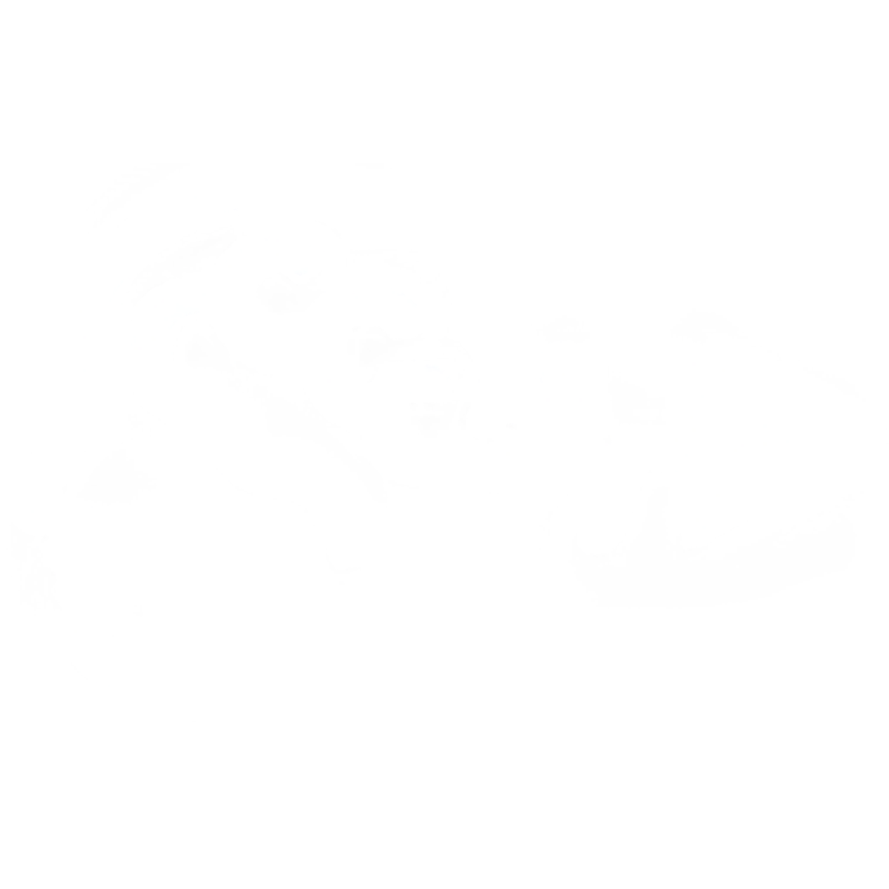
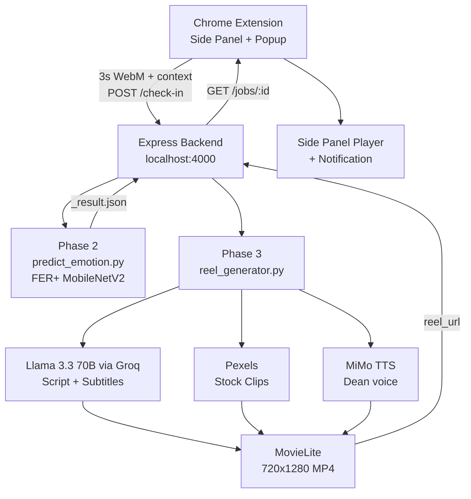
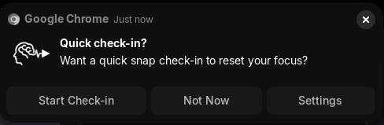
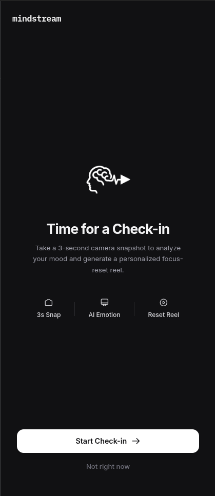
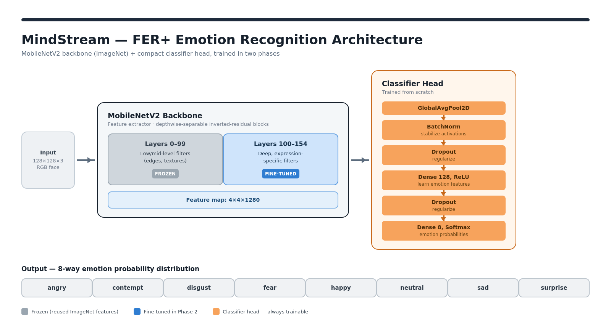
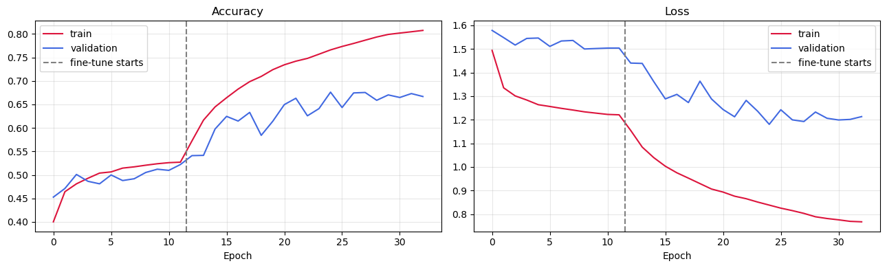
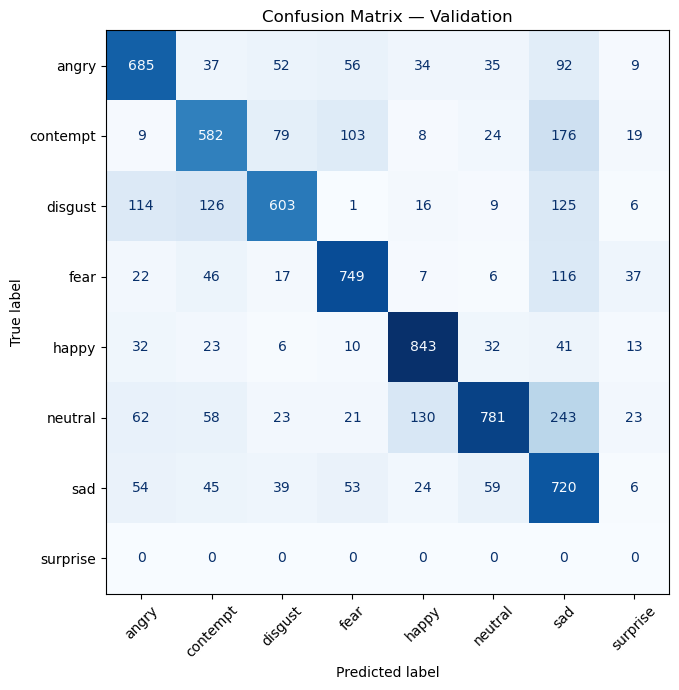
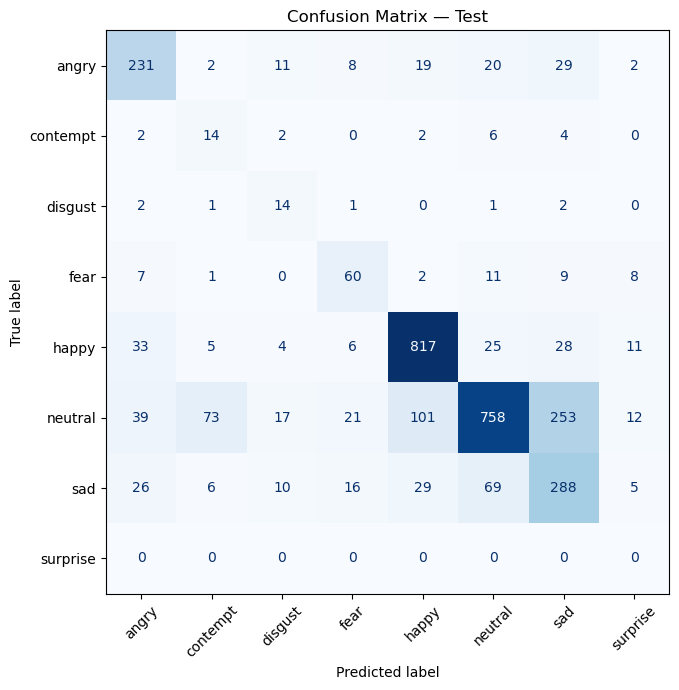

<div align="center">
  

# MindStream

A Chrome extension that reads your expression and generates a short personalized focus-reset reel. Three-second check-in, fully local pipeline.

</div>

---

## The Problem

Most wellness nudges are generic. MindStream makes the check-in specific to you — your expression right now, what you were doing, what time it is — and turns that into a short video that actually lands.

---

## System Architecture



---

## Phase 1 — Browser Capture

|                  |                                                   |
| ---------------- | ------------------------------------------------- |
| **What**         | 3s WebM clip at 640x480, no audio                 |
| **Where**        | Saved to `~/Downloads/mindstream_captures/`       |
| **Context sent** | `user_name`, `active_tab_category`, `time_of_day` |

The extension classifies the active tab domain into a category (`coding`, `entertainment`, `social_media`, `research`, `shopping`, `browsing`) and sends it alongside the clip path to the backend.





---

## Phase 2 — Emotion Detection

> _This section was written by Sulav._

|                   |                                            |
| ----------------- | ------------------------------------------ |
| **Task**          | 8-class facial emotion classification      |
| **Dataset**       | FER+ -- 66.4K train / 7.3K val / 3.1K test |
| **Backbone**      | MobileNetV2 (ImageNet pretrained)          |
| **Input**         | 128x128x3                                  |
| **Test Accuracy** | **69.9%** (5.6x random baseline of 12.5%)  |

### Neural Network Architecture



A face goes in at **128x128x3** and flows through the MobileNetV2 backbone in two zones: a **frozen block** (gray, layers 0-99) that reuses generic ImageNet vision -- edges, textures, shapes -- and a **fine-tuned block** (blue, layers 100-154) that re-specializes those deeper filters specifically for facial expressions. The backbone's output is a **4x4x1280 feature map** -- a compact "fingerprint" of the face. A lightweight classifier head (orange) -- GlobalAvgPool -> BatchNorm -> Dropout -> Dense(128) -> Dropout -> Dense(8, Softmax) -- turns that fingerprint into 8 emotion probabilities.

- **Frozen zone** -- cheap, stable, never touched during training
- **Fine-tuned zone** -- the only part of the backbone that adapts to faces
- **Head** -- the only part trained completely from scratch

---

### Training Dynamics -- Accuracy & Loss



Training happens in two clean phases, split by the dashed line at **epoch ~11**. In **Phase 1**, the backbone stays frozen and only the head learns -- accuracy climbs steadily but slowly, since it's working with generic ImageNet features it hasn't customized yet. The moment **Phase 2** (fine-tuning) kicks in, validation accuracy jumps sharply and loss drops in lockstep -- proof the deeper backbone layers were the missing piece. Both curves then plateau cleanly in the high-60% range, with no divergence between train and validation, meaning the model converges rather than overfitting.

---

### Confusion Matrices -- Proof in the Numbers

Each matrix's diagonal shows **correct predictions**; the darker and heavier the diagonal, the stronger the model. Rows are the true emotion, columns are the predicted one.

#### Validation Set (7,341 images)



#### Test Set (3,123 images -- held-out, unseen data)



**What stands out:**

- **`happy`** is the model's strongest class -- **817/929** test faces correctly identified, the darkest, most dominant cell on the whole matrix
- **`angry`** holds up well even on unseen test data -- **231/322** correct, consistent with its validation performance
- The model **generalizes**: the diagonal pattern seen in validation carries over cleanly to the test set, so this isn't just memorization of the training distribution

---

### Class Weighting -- Prioritizing Negative Emotions

| Group                   | Emotions                            | Weight |
| ----------------------- | ----------------------------------- | ------ |
| **Negative (priority)** | angry, contempt, disgust, fear, sad | x1.0   |
| **Mild**                | happy, neutral, surprise            | x0.6   |

Missing a genuinely negative emotion matters more in a wellbeing context than confusing "neutral" for "surprise" -- so training gradients are deliberately nudged to catch negative states first. That trade-off is visible directly in the confusion matrices above.

---

### Results -- Proven Effectiveness (69.9% Test Accuracy)

| Emotion | F1       | Recall    | Highlight                                                          |
| ------- | -------- | --------- | ------------------------------------------------------------------ |
| happy   | **0.86** | 0.879     | Near-human-level recognition                                       |
| neutral | 0.70     | 0.595     | High precision -- very few false alarms                            |
| angry   | 0.70     | **0.717** | Consistently reliable across both splits                           |
| fear    | 0.57     | **0.612** | Solid catch-rate on a subtle emotion                               |
| sad     | 0.54     | **0.641** | Recall prioritized by design -- rarely misses a genuinely sad face |

**Headline numbers:**

- **69.9%** overall test accuracy on an 8-class problem (random baseline: 12.5%) -- a **5.6x lift** over chance
- **86% F1** on `happy`, the most common real-world class
- **+15.6 points** validation accuracy gained purely from fine-tuning (52.2% -> 67.6%)

---

### Takeaways

1. **Transfer learning delivers** -- a clean, large accuracy jump from strategic partial fine-tuning, visible directly in the training curves
2. **Weighting strategy works as intended** -- strong, consistent recall on the priority negative-emotion classes
3. **Generalizes well** -- validation and test confusion matrices show matching diagonal strength, not overfitting
4. **Efficient by design** -- a small, mostly-frozen model that still performs well above chance across nearly every class

---

### How Phase 2 plugs into the pipeline

The model lives at `core_ai/MODELS/CV/best_ferplus_emotion.keras`. When the backend receives a check-in it spawns `predict_emotion.py`:

1. Extracts 5 evenly-spaced frames from the WebM (PyAV)
2. Detects face via OpenCV Haar cascade, falls back to full frame
3. Resizes to 128x128, applies MobileNetV2 `preprocess_input`
4. Averages softmax probabilities across all 5 frames
5. 30% confidence threshold -- below that defaults to `neutral`
6. Writes result next to the clip:

```json
{ "emotion": { "label": "happy", "confidence": 0.74 } }
```

Chokidar picks up that file and immediately triggers Phase 3.

---

## Phase 3 -- Personalized Reel Generation

```
emotion + context
      |
      v
Llama 3.3 70B via Groq  -->  45-60s script + subtitle phrases
      |
      v
Llama 3.3 70B via Groq  -->  8-10 cinematic search keywords
      |
      v
Pexels API         -->  stock video clips (max 5s each)
      |
      v
MiMo TTS           -->  MP3 narration (Dean voice)
      |
      v
MovieLite          -->  720x1280 MP4 (clips + TTS + ambient audio + subtitles)
```

Script is personalized using all three context fields:

| Field                 | Example | How it is used                        |
| --------------------- | ------- | ------------------------------------- |
| `user_name`           | Prash   | Addressed directly in narration       |
| `active_tab_category` | coding  | Shapes the script's emotional framing |
| `time_of_day`         | evening | Sets tone and pacing                  |

---

## End-to-End Flow

```
[Phase 1]  Popup records 3s WebM
                    |
                    v
           Saved to ~/Downloads/mindstream_captures/
                    |
                    v
           POST /check-in  {clip_path, context}
                    |
                    v
[Backend]  Spawns predict_emotion.py
                    |
                    v
[Phase 2]  5 frames -> face crop -> MobileNetV2 -> _result.json
                    |
                    v
[Backend]  Chokidar detects JSON -> spawns reel_generator.py
                    |
                    v
[Phase 3]  Llama 3.3 70B script -> Pexels clips -> MiMo TTS -> MovieLite
                    |
                    v
           output/reels/<filename>.mp4
                    |
                    v
[Extension] Poll /jobs/:id -> "ready"
            Chrome notification fires
            User watches reel in side panel
```

---

## Technology Stack

| Layer         | Technology                                     |
| ------------- | ---------------------------------------------- |
| Extension     | Chrome MV3 · React 19 · Vite · Tailwind CSS v4 |
| Backend       | Node.js · Express · Chokidar                   |
| Emotion model | TensorFlow / Keras · MobileNetV2 · FER+        |
| Inference     | PyAV · OpenCV · tf-keras                       |
| Script        | Llama 3.3 70B via Groq                         |
| TTS           | MiMo API (Dean voice)                          |
| Video         | Pexels · MovieLite · Pixabay (fallback)        |

---

## Live Demo -- 5-Minute Flow

1. **(30s)** Open side panel. Show idle screen. "Most tools just remind you to take a break. MindStream reads your expression and generates something personal."
2. **(45s)** Show architecture diagram. Three phases, all local.
3. **(60s)** Phase 2 -- show training curves and confusion matrices. "Sulav trained this on 66K faces. 69.9% on 8 classes, 5.6x above random."
4. **(60s)** Click Check in, let the popup record, confirm. Show processing screen.
5. **(30s)** Show backend terminal -- script, keywords, download, TTS, compose.
6. **(60s)** Notification fires. Watch reel in the panel.
7. **(15s)** "One clip. Three phases. Your face told it what to say."

## Future Improvements

- **AI video generation** -- replace Pexels stock clips with model-generated footage (Runway, Sora) for fully unique visuals every time
- **On-device emotion inference** -- run the FER+ model in the browser via TensorFlow.js, removing the Python backend dependency for Phase 2
- **Ambient audio generation** -- generate the 8 emotion-matched audio files with a text-to-audio model instead of manual creation
- **Chrome Web Store** -- sign and publish the extension for one-click install

