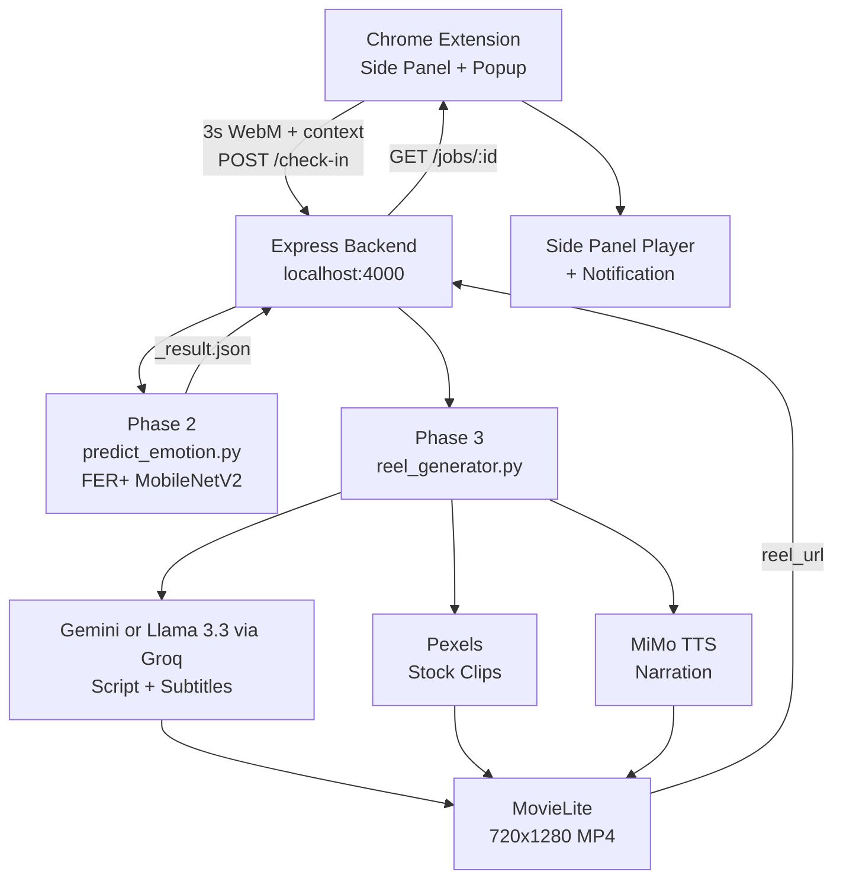

<div align="center">
  
  
  <h1>MindStream</h1>
  
  <p>A Chrome extension that reads your expression and generates a short personalized focus-reset reel.<br>Three-second check-in, personalized pipeline.</p>
</div>

## Overview

MindStream is a three-phase pipeline built as a college project.

Phase 1 captures a 3-second webcam clip from a Chrome extension popup. Phase 2 runs facial emotion detection using a MobileNetV2 model trained on FER+. Phase 3 generates a personalized 720x1280 reel using an LLM script, stock footage, TTS narration, and ambient audio.

---

## How It Works



---

## Setup

**Backend**

```bash
cd backend
python -m venv venv && source venv/bin/activate
pip install -r requirements.txt
cp .env.example .env  # add your API keys
npm install && npm start
```

**Extension**

```bash
npm install && npm run build
```

Load `dist/` as an unpacked extension in Chrome (`chrome://extensions` → Load unpacked).

## API Keys

| Key               | Required             | Purpose                                     |
| ----------------- | -------------------- | ------------------------------------------- |
| `GEMINI_API_KEY`  | ✓ (default provider) | Script generation (Gemini 2.0 Flash)        |
| `PEXELS_API_KEY`  | ✓                    | Background video clips                      |
| `MIMO_API_KEY`    | ✓                    | TTS narration                               |
| `GROQ_API_KEY`    | optional             | Alternative script provider (Llama 3.3 70B) |
| `PIXABAY_API_KEY` | optional             | Fallback video source                       |

By default, MindStream uses Google Gemini for script generation. To switch to Groq, set `SCRIPT_MODEL_PROVIDER=groq` and `SCRIPT_MODEL_NAME=llama-3.3-70b-versatile` in your `.env` and supply a `GROQ_API_KEY`.

Get keys: [Gemini](https://aistudio.google.com/app/apikey) · [Pexels](https://www.pexels.com/api/) · [MiMo](https://platform.xiaomimimo.com/console/api-keys) · [Groq](https://console.groq.com/keys)

## Phase 1: Browser Capture

|                  |                                                   |
| ---------------- | ------------------------------------------------- |
| **What**         | 3s WebM clip at 640x480, no audio                 |
| **Where**        | Saved to `~/Downloads/mindstream_captures/`       |
| **Context sent** | `user_name`, `active_tab_category`, `time_of_day` |

The extension classifies the active tab domain into a category (`coding`, `entertainment`, `social_media`, `research`, `shopping`, `browsing`) and sends it alongside the clip path to the backend.


## Phase 2: Emotion Detection

|                   |                                           |
| ----------------- | ----------------------------------------- |
| **Task**          | 8-class facial emotion classification     |
| **Dataset**       | FER+ (66.4K train / 7.3K val / 3.1K test) |
| **Backbone**      | MobileNetV2 (ImageNet pretrained)         |
| **Input**         | 128x128x3                                 |
| **Test Accuracy** | **69.9%** (5.6x random baseline of 12.5%) |

### Neural Network Architecture


A face goes in at **128x128x3** and flows through the MobileNetV2 backbone in two zones: a **frozen block** (gray, layers 0-99) that reuses generic ImageNet vision (edges, textures, shapes) and a **fine-tuned block** (blue, layers 100-154) that re-specializes deeper filters specifically for facial expressions. The backbone output is a **4x4x1280 feature map** (a compact fingerprint of the face). A lightweight classifier head (orange, GlobalAvgPool → BatchNorm → Dropout → Dense(128) → Dropout → Dense(8, Softmax)) turns that fingerprint into 8 emotion probabilities.

- **Frozen zone**: cheap, stable, never touched during training
- **Fine-tuned zone**: the only part of the backbone that adapts to faces
- **Head**: the only part trained completely from scratch

### Training Dynamics: Accuracy & Loss


Training happens in two clean phases, split by the dashed line at **epoch ~11**. In **Phase 1**, the backbone stays frozen while only the head learns. Accuracy climbs steadily, working with generic ImageNet features. The moment **Phase 2** (fine-tuning) begins, validation accuracy jumps sharply and loss drops in lockstep, proving the deeper backbone layers adapt to facial features. Both curves plateau cleanly in the high-60% range without divergence between train and validation.

### Confusion Matrices: Proof in the Numbers

Each matrix's diagonal shows **correct predictions**; the darker the diagonal, the stronger the model. Rows are the true emotion, columns are the predicted one.

#### Validation Set (7,341 images)


#### Test Set (3,123 images, held-out unseen data)


**What stands out:**

- **`happy`** is the model's strongest class: **817/929** test faces correctly identified
- **`angry`** holds up well on unseen test data: **231/322** correct, consistent with validation performance
- The model **generalizes**: the diagonal pattern seen in validation carries over cleanly to the test set

### Class Weighting: Prioritizing Negative Emotions

| Group                   | Emotions                            | Weight |
| ----------------------- | ----------------------------------- | ------ |
| **Negative (priority)** | angry, contempt, disgust, fear, sad | x1.0   |
| **Mild**                | happy, neutral, surprise            | x0.6   |

Missing a genuinely negative emotion matters more in a wellbeing context than confusing "neutral" for "surprise", so training gradients are deliberately weighted to catch negative states first. That trade-off is visible directly in the confusion matrices above.

### Results: 69.9% Test Accuracy

| Emotion | F1       | Recall    | Highlight                                                        |
| ------- | -------- | --------- | ---------------------------------------------------------------- |
| happy   | **0.86** | 0.879     | Near-human-level recognition                                     |
| neutral | 0.70     | 0.595     | High precision, very few false alarms                            |
| angry   | 0.70     | **0.717** | Consistently reliable across both splits                         |
| fear    | 0.57     | **0.612** | Solid catch-rate on a subtle emotion                             |
| sad     | 0.54     | **0.641** | Recall prioritized by design, rarely misses a genuinely sad face |

**Headline numbers:**

- **69.9%** overall test accuracy on an 8-class problem (random baseline: 12.5%), representing a **5.6x lift** over chance
- **86% F1** on `happy`, the most common real-world class
- **+15.6 percentage points** validation accuracy gained purely from fine-tuning (52.2% → 67.6%)

### Takeaways

1. **Transfer learning delivers**: a clean accuracy jump from strategic partial fine-tuning, visible in the training curves
2. **Weighting strategy works as intended**: strong recall on priority negative-emotion classes
3. **Generalizes well**: validation and test confusion matrices show matching diagonal strength, avoiding overfitting
4. **Efficient by design**: a small, mostly-frozen model that performs well above chance across nearly every class

### How Phase 2 plugs into the pipeline

The model lives at `core_ai/MODELS/CV/best_ferplus_emotion.keras`. When the backend receives a check-in it spawns `predict_emotion.py`:

1. Extracts 5 evenly-spaced frames from the WebM (PyAV)
2. Detects face via OpenCV Haar cascade, falls back to full frame
3. Resizes to 128x128, applies MobileNetV2 `preprocess_input`
4. Averages softmax probabilities across all 5 frames
5. 28% confidence threshold: below that defaults to `neutral`
6. Writes result next to the clip:

```json
{ "emotion": { "label": "happy", "confidence": 0.74 } }
```

Chokidar picks up that file and immediately triggers Phase 3.

## Phase 3: Personalized Reel Generation

```
emotion + context
      |
      v
Gemini or Llama 3.3 via Groq  -->  45-60s script + subtitle phrases
      |
      v
Gemini or Llama 3.3 via Groq  -->  8-10 cinematic search keywords
      |
      v
Pexels API                    -->  stock video clips (max 5s each)
      |
      v
MiMo TTS                      -->  MP3 narration
      |
      v
MovieLite                     -->  720x1280 MP4 (clips + TTS + ambient audio + subtitles)
```

Script is personalized using all three context fields:

| Field                 | Example | How it is used                        |
| --------------------- | ------- | ------------------------------------- |
| `user_name`           | Prash   | Addressed directly in narration       |
| `active_tab_category` | coding  | Shapes the script's emotional framing |
| `time_of_day`         | evening | Sets tone and pacing                  |

---

## Technology Stack

| Layer         | Technology                                                  |
| ------------- | ----------------------------------------------------------- |
| Extension     | Chrome MV3 · React 19 · Vite · Tailwind CSS v4              |
| Backend       | Node.js · Express · Chokidar                                |
| Emotion model | TensorFlow/Keras · MobileNetV2 · FER+ (69.9% test accuracy) |
| Inference     | PyAV · OpenCV · tf-keras                                    |
| Script        | Google Gemini or Llama 3.3 via Groq (configurable)          |
| TTS           | MiMo API                                                    |
| Video         | Pexels · MovieLite · Pixabay (fallback)                     |

## Future Improvements

- **Offline / reduced external dependency**: script generation, voice narration, and video clip retrieval currently depend on external APIs and require an internet connection; replacing these with on-device or self-hosted alternatives would remove that requirement
- **Improved privacy**: all data would stay on-device once external API calls are eliminated
- **AI video generation**: replace Pexels stock clips with model-generated footage for fully unique visuals every time
- **On-device emotion inference**: run the FER+ model in the browser via TensorFlow.js, removing the Python backend dependency for Phase 2
- **Ambient audio generation**: generate emotion-matched audio with a text-to-audio model
- **Chrome Web Store**: sign and publish the extension for one-click install
